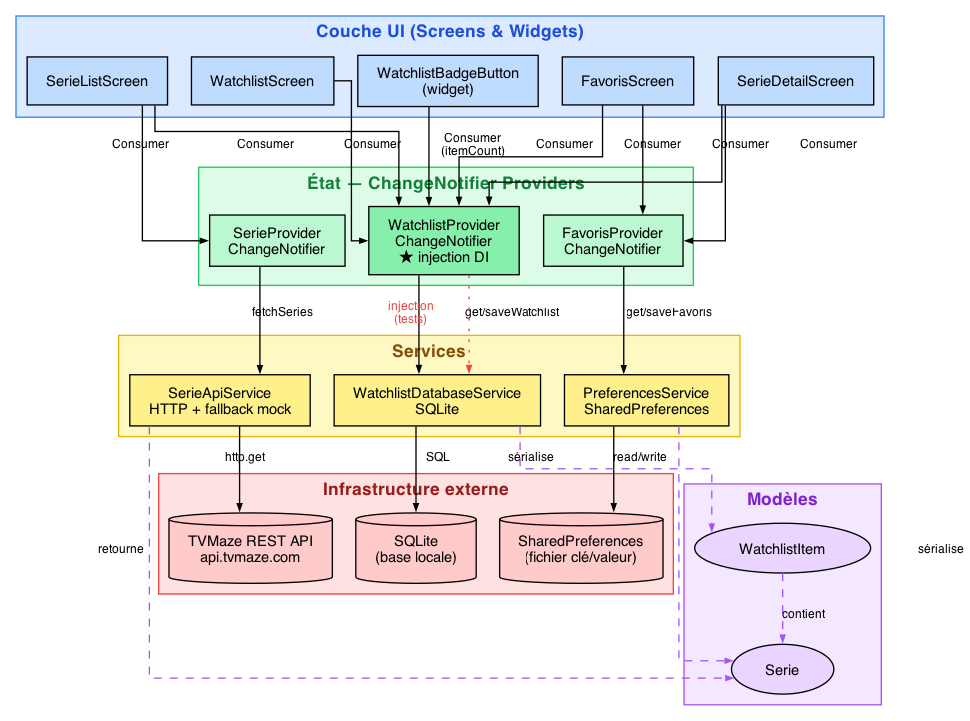

# serie_liste — correction TD6

Application de suivi de séries TV : catalogue TVMaze, favoris (SharedPreferences), watchlist avec statuts (SQLite).

 [](https://github.com/roza/serie_liste_flutter/actions/workflows/coverage.yml)

[](https://codecov.io/gh/roza/serie_liste_flutter)



## App principale

- Étapes 1 à 9 du TD complètes (modèles, services, providers, écrans, tests).
- **les trois providers** (`SerieProvider`, `FavorisProvider`, `WatchlistProvider`) acceptent leur service via le constructeur   (injection de dépendance).
- Bonus : badge `itemCount` sur l'icône watchlist dans l'AppBar (`lib/screens/serie_list_screen.dart`).

## Lancer l'app et les tests

```bash
flutter pub get
flutter run                                          # app
flutter test test/unit/                              # 36 tests unitaires (VM, ~2 s)
flutter test test/user_story/                        # widget test avec fakes (VM, ~1 s)
flutter test integration_test/app_test.dart -d macos # end-to-end sur device (~14 s)
flutter analyze                                      # 0 issue
```

Les trois familles de tests sont complémentaires : unitaires pour la couche métier en isolation, *user story* en widget test pour le parcours d'écran à écran, et `integration_test` pour la validation end-to-end avec vraies persistance et API.

## Différence avec le TD

Le TD montre `SerieProvider` et `FavorisProvider` d'abord avec leur service instancié en dur (étapes 3 et 5), puis introduit l'injection de dépendance à l'étape 8 sur `WatchlistProvider`, et propose ensuite d'appliquer le même pattern aux deux autres providers.

Cette correction présente directement l'**état final** : injection de dépendance partout.

Tests correspondants présents :

- `test/unit/providers/serie_provider_test.dart` — utilise l'injection de dépendance (`MockHttpClient`)
- `test/unit/providers/favoris_provider_test.dart` — utilise l'injection de dépendance (`MockPreferencesService`)
- `test/unit/providers/watchlist_provider_test.dart` — version complétée des `// TODO` du starter

## Couverture des tests

Flutter génère un rapport au format `lcov` avec l'option `--coverage`. Les paquets `lcov` et `genhtml` (lcov à installer via `apt` sous Linux ou WSL, sous Windows, `brew` ou `macports` sous mac) permettent ensuite d'obtenir un résumé textuel ou HTML.
Si l'installation de ces outils en local vous semble trop fastidieuse, vous pouvez vous contenter d'utiliser `coverde` ou l'intégration continue (CI), cf plus loin.

```bash
# 1. Générer lcov.info pour tous les tests unitaires
flutter test --coverage test/unit/

# 2. Résumé global
lcov --summary coverage/lcov.info

# 3. Détail par fichier
lcov --list coverage/lcov.info

# 4. Rapport HTML navigable (lignes vertes/rouges)
genhtml coverage/lcov.info -o coverage/html
open coverage/html/index.html       # Linux : xdg-open

# 5. Couverture d'un seul fichier de test (utile pour cibler une étape)
flutter test --coverage test/unit/services/watchlist_database_service_test.dart
lcov --list coverage/lcov.info
```

### Alternative multiplateforme : `coverde` (sans lcov)

`lcov` est lourd à installer sous Windows. [`coverde`](https://pub.dev/packages/coverde) est un outil Dart pur qui lit `coverage/lcov.info` et fournit résumé, rapport HTML et seuil de couverture — installable simplement via `pub`.

#### Installation

```bash
dart pub global activate coverde
```

Pour utiliser la commande `coverde` directement, il faut que le dossier des binaires `pub` soit dans le `PATH` :

- **Linux / macOS** : ajouter à `~/.bashrc`, `~/.zshrc` ou `~/.profile` :
  ```bash
  export PATH="$PATH":"$HOME/.pub-cache/bin"
  ```
- **Windows (PowerShell)** : ajouter `%LOCALAPPDATA%\Pub\Cache\bin` au `Path` utilisateur (Paramètres → *Variables d'environnement*), ou en ligne de commande :
  ```powershell
  setx PATH "$env:PATH;$env:LOCALAPPDATA\Pub\Cache\bin"
  ```

Vérification : `coverde --version` doit répondre. Sinon, on peut toujours invoquer `dart pub global run coverde ...` à la place.

#### Utilisation de coverde

```bash
# 1. Générer lcov.info
flutter test --coverage

# 2. Résumé textuel par fichier (équivalent de lcov --list)
coverde value

# 3. Vérifier un seuil minimum (échoue si < 60 %)
coverde check 60

# 4. Rapport HTML navigable (généré dans coverage/html/ par défaut)
coverde report
```

`coverde check` retourne un code de sortie non nul sous le seuil : pratique en CI pour bloquer un merge si la couverture régresse.

### Intégration continue avec badge Codecov

Le badge `codecov` en haut du README provient de [Codecov.io](https://about.codecov.io/), qui héberge le rapport de couverture publié à chaque exécution de la CI GitHub Actions.

#### Comment fonctionne la CI GitHub Actions

GitHub Actions exécute, à chaque `push` ou *pull request*, un *workflow* décrit dans un fichier YAML sous `.github/workflows/`. Chaque exécution se fait dans un **runner** : une machine virtuelle éphémère (ici `ubuntu-latest` — VM Ubuntu jetable, recréée à chaque run) fournie gratuitement par GitHub pour les dépôts publics. Les *steps* s'enchaînent séquentiellement ; si l'un échoue (code de sortie ≠ 0), le job échoue, le badge passe au rouge et les *checks* de la PR sont marqués en erreur.

> **VM ou Docker ?** GitHub Actions utilise de **vraies VMs** (Azure), pas des conteneurs : meilleure isolation pour du code non-fiable (PR de forks), support multi-OS (Linux/Windows/macOS), virtualisation imbriquée et outils pré-installés volumineux possibles. **GitLab CI** fait l'inverse — ses *shared runners* exécutent chaque job dans un **conteneur Docker** basé sur l'image que tu indiques (`image: ...` en tête de `.gitlab-ci.yml`) : démarrage plus rapide, meilleure densité, mais Linux uniquement par défaut.

Le fichier [`.github/workflows/coverage.yml`](.github/workflows/coverage.yml) contient :

| Bloc | Rôle |
|---|---|
| `on: push / pull_request` (branche `main`) | Déclencheur : la CI tourne à chaque push sur `main` et sur chaque PR ciblant `main` |
| `runs-on: ubuntu-latest` | Choix du runner (VM Ubuntu fournie par GitHub) |
| `actions/checkout@v4` | Clone le dépôt dans le runner |
| `subosito/flutter-action@v2` | Installe le SDK Flutter (canal *stable*, avec cache) |
| `apt-get install lcov` | Installe `lcov` pour le résumé de couverture |
| `flutter pub get` | Récupère les dépendances |
| `flutter analyze` | Analyse statique — échoue à la première *issue* |
| `flutter test --coverage test/` | Exécute tous les tests et produit `coverage/lcov.info` — échoue dès qu'un test casse |
| `lcov --summary >> $GITHUB_STEP_SUMMARY` | Affiche le résumé directement sur la page du run |
| `codecov/codecov-action@v4` | Téléverse `lcov.info` vers Codecov |

#### Quand un push ou un merge est bloqué

Par défaut un `push` direct n'est **jamais** bloqué : la CI tourne *après* coup et signale une régression via badge rouge + email.

Pour bloquer réellement les régressions, activer dans GitHub *Settings → Branches → Branch protection rules* sur `main` :

- ✅ *Require status checks to pass before merging* → cocher le check `test` (nom du job dans `coverage.yml`).
- ✅ *Require branches to be up to date before merging* (optionnel mais recommandé).
- ✅ Pour imposer un **seuil de couverture**, configurer Codecov via un fichier `codecov.yml` à la racine, p.ex. :
  ```yaml
  coverage:
    status:
      project:
        default:
          target: 70%
          threshold: 1%
  ```
  Codecov publie alors un check distinct (`codecov/project`) qui échoue si la couverture descend sous 70 % — il suffit de l'ajouter aux *required status checks*. Alternative locale : ajouter une étape `coverde check 70` dans le workflow.

Avec ces règles, **toute PR dont la CI échoue (tests cassés, couverture < seuil) ne peut plus être mergée** ; les pushs directs sur `main` peuvent en plus être interdits via *Restrict who can push to matching branches*.

#### Mise en place du token Codecov

1. **Créer un compte** sur [codecov.io](https://about.codecov.io/) en se connectant via GitHub.
2. **Autoriser le dépôt** : dans le tableau de bord Codecov, sélectionner le dépôt à couvrir (l'app GitHub *Codecov* doit avoir accès à l'organisation/utilisateur).
3. **Token d'upload** *(uniquement pour les dépôts privés ou si l'upload tokenless échoue)* : récupérer le `CODECOV_TOKEN` dans *Settings → General* sur Codecov, puis l'ajouter dans GitHub : *Settings → Secrets and variables → Actions → New repository secret*, nom `CODECOV_TOKEN`. Pour un dépôt **public**, l'action `codecov/codecov-action` fonctionne sans token.
4. Le workflow `.github/workflows/coverage.yml` exécute `flutter test --coverage` puis envoie `coverage/lcov.info` via l'action :
   ```yaml
   - uses: codecov/codecov-action@v4
     with:
       files: coverage/lcov.info
       token: ${{ secrets.CODECOV_TOKEN }}   # optionnel sur dépôt public
   ```
5. Adapter l'URL des badges en haut du README (`roza/serie_liste_flutter`) à votre `<user>/<repo>`.

### Résultat attendu

Avec les tests fournis, la couche métier est couverte à environ **86 %** :

| Fichier | Couverture |
|---|---|
| `services/watchlist_database_service.dart` | 100 % |
| `providers/watchlist_provider.dart` | ~94 % |
| `services/serie_api_service.dart` | ~93 % |
| `models/watchlist_item.dart` | ~93 % |
| `providers/favoris_provider.dart` | ~93 % |
| `models/serie.dart` | ~87 % |
| `providers/serie_provider.dart` | ~87 % |
| `services/preferences_service.dart` | 0 % (voir note) |

> **Remarque** : le 0 % sur `preferences_service.dart` n'est pas un trou de qualité — les tests passent par `MockPreferencesService`, qui hérite et surcharge `getFavoris`/`saveFavoris`. Le code de production n'est donc jamais exécuté pendant les tests.

Les fichiers UI (`main.dart`, `router.dart`, `lib/screens/*.dart`) n'apparaissent pas dans le rapport : ils ne sont chargés par aucun test unitaire. Les couvrir nécessiterait des *widget tests* ou des tests d'intégration que vous devez ajouter à votre projet.

Par exemple, ajouter ici un test de parcours utilisateur ([`test/user_story/user_journey_test.dart`](test/user_story/user_journey_test.dart)) qui exécute la *user story* suivante :

> **Marie** ouvre SérieListe : elle voit la liste des séries, tape sur *Breaking Bad* pour consulter le détail, l'ajoute aux favoris puis à la watchlist. Elle revient à l'accueil — un badge `1` apparaît sur l'icône watchlist. Elle ouvre l'écran des favoris pour vérifier que *Breaking Bad* y figure, puis l'écran de la watchlist où elle change le statut de visionnage de « À voir » à « En cours ».

Ce seul test utilise simultanément les 4 écrans, les 3 providers, le routeur GoRouter et la chaîne d'injection de dépendance — `MockHttpClient` (custom, qui route `/shows` vs `/shows/<id>`) + `MockPreferencesService` + SQLite (en mémoire).

On peut ensuite retester la couverture par les tests :

```bash
flutter test --coverage test/                # unitaires + intégration
lcov --list coverage/lcov.info
```

Avec ce test ajouté, `lib/screens/*.dart` et `lib/router.dart` apparaissent dans le rapport et la couverture globale dépasse 90 %.

## Test d'intégration end-to-end (non demandé dans le TD et optionnel dans le projet mais bonus possible)

Une seconde version du parcours est fournie dans `integration_test/app_test.dart`. Celle-ci lance la **vraie app** sur un device, avec **vraie API TVMaze**, **vraie SharedPreferences** et **vraie SQLite**. À utiliser sur desktop (pas sur Chrome) :

```bash
flutter test integration_test/app_test.dart -d macos    # ou -d windows / -d linux
```

Le test prend une dizaine de secondes (build de l'app + lancement + scénario), nettoie la persistance avant exécution pour être rejouable.

Pour les détails sur les deux approches (widget test avec fakes vs `integration_test` sur device), la mécanique des microtâches/`pump`, et la pyramide de tests recommandée pour SQLite, voir [`test_integration.md`](test_integration.md).

